# ClaudeCompass


ClaudeCompass is a Claude Code connector/plugin that, **today, focuses on one thing: spending fewer tokens per task.** A coding agent burns tokens in three places, and ClaudeCompass installs and wires a plugin for each — in one guided flow:

1. **Reading the codebase** — [CodeGraph](https://github.com/colbymchenry/codegraph) answers structural questions from a local graph instead of crawling files.
2. **Input to the prompt** — [Headroom](https://github.com/headroomlabs-ai/headroom) compresses bulky tool output, logs, and JSON before they enter context.
3. **Output from the prompt** — [Caveman](https://github.com/JuliusBrussee/caveman) trims filler from responses while keeping code, commands, and errors byte-for-byte.

Around that core it also sets up durable memory (Graphify + an Obsidian vault), token/cost visibility (`ccusage` statusline), conservative permission defaults, and MCP templates — with a `doctor` command that verifies what is installed and what still needs user approval.

This repo is intentionally honest about OS permissions: macOS and Windows may still require the user to approve privacy/security prompts. ClaudeCompass can open the path and configure the stack, but it should not bypass OS consent.


## What It Gives Users

ClaudeCompass is meant to feel like one connector that turns Claude Code from a raw terminal agent into a configured workspace companion:

- It remembers project context through Graphify and a human-readable Obsidian vault.
- It gives Claude a live code knowledge graph via **CodeGraph**, and keeps the per-project index synced each session.
- It reduces output tokens with **Caveman** and input/context tokens with **Headroom**.
- It shows token and cost usage without asking users to remember commands.
- It prepares MCP config for Obsidian and Graphify, and wires the CodeGraph and Headroom MCP servers through their own installers.
- It adds conservative Claude Code permission defaults.
- It gives users `/setup`, `/doctor`, `/tokens`, `/memory`, `/uninstall`, `/codegraph`, `/caveman`, and `/headroom` entry points.

## How It Saves Tokens



Each plugin targets a different token "leak," so their savings stack across the same task instead of competing. Figures below are **self-reported by each open-source project** under their own benchmarks:

| Where tokens leak | Plugin | Reported savings |
| --- | --- | --- |
| Reading the codebase (agent → files) | **CodeGraph** | ~69% fewer tokens, ~89% fewer tool calls, file reads → 0 across 7 repos |
| Input to the prompt (agent → model) | **Headroom** | 60–95% on JSON/data, ~20% on coding, accuracy held (±0.000 on GSM8K) |
| Output from the prompt (model → agent) | **Caveman** | ~65% fewer output tokens (range 22–87%) |

## Bundled Tools

ClaudeCompass installs and wires these three tools during setup:

- **[CodeGraph](https://github.com/colbymchenry/codegraph)** — a local code knowledge graph (`codegraph_explore` MCP tool). ClaudeCompass runs `codegraph install` to wire the MCP server and adds a SessionStart hook that runs `codegraph sync`/`init` so the index stays current.
- **[Caveman](https://github.com/JuliusBrussee/caveman)** — output-token compression. Installed via its own installer (guarded by a marker so re-runs are idempotent), which registers `/caveman` commands in Claude Code.
- **[Headroom](https://github.com/headroomlabs-ai/headroom)** — input/context compression before payloads reach the model. ClaudeCompass runs `headroom mcp install` to expose `headroom_compress`/`headroom_retrieve`/`headroom_stats`.

## Commands

| Command | What it does |
| --- | --- |
| `/claude-compass:setup` | Install or repair the full stack |
| `/claude-compass:doctor` | Verify what is installed and what needs approval |
| `/claude-compass:tokens` | Show token and cost usage |
| `/claude-compass:memory` | Work with Graphify and the Obsidian vault |
| `/claude-compass:codegraph` | Explore code via the CodeGraph index |
| `/claude-compass:caveman` | Compress output tokens |
| `/claude-compass:headroom` | Compress input/context tokens |
| `/claude-compass:uninstall` | Remove local ClaudeCompass files safely |

## Install

From GitHub:

```bash
claude plugin marketplace add ganeshparsads/ClaudeCompass
claude plugin install claude-compass@claude-compass
```

Or from a local checkout:

```bash
claude plugin marketplace add ./ClaudeCompass
claude plugin install claude-compass@claude-compass
```

Then in Claude Code:

```text
/claude-compass:setup
/claude-compass:doctor
/claude-compass:tokens
```

## Bootstrap Directly

macOS:

```bash
./plugins/claude-compass/bin/bootstrap-macos.sh
```

Windows PowerShell:

```powershell
.\plugins\claude-compass\bin\bootstrap-windows.ps1
```

## Current Status

Version `0.2.0`, targeting Claude Code. It follows the Claude Code plugin structure documented by Anthropic: marketplace catalog at `.claude-plugin/marketplace.json`, plugin manifest at `plugins/claude-compass/.claude-plugin/plugin.json`, and plugin components at the plugin root.

Implemented today:

- token-saving core: CodeGraph, Caveman, and Headroom installed and wired
- SessionStart hook that keeps the CodeGraph index synced per session
- safe setup scripts (macOS + Windows) with idempotent re-runs
- settings merge with backup, and conservative permission defaults
- token monitor statusline and MCP config templates
- setup, doctor, tokens, memory, uninstall, codegraph, caveman, and headroom skills
- graceful fallback when an optional package is unavailable

## Roadmap

The near-term direction is to grow from a token-saving core into a broader startup kit:

- Support more coding agents beyond Claude Code — **Codex** and **Groq**.
- Add role-specific kits per **job family** (frontend, backend, data/ML, DevOps) on top of the token-saving base.
- Add a polished desktop one-click installer.
- Add Obsidian Local REST API setup validation.
- Add automatic session summary hooks into the vault.
- Add Graphify query-before-search hooks.
- Add first-party, measured token-savings numbers on real repos.
