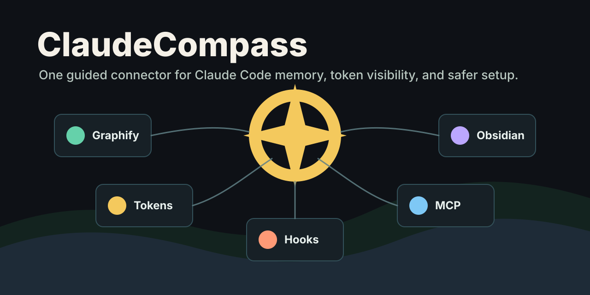
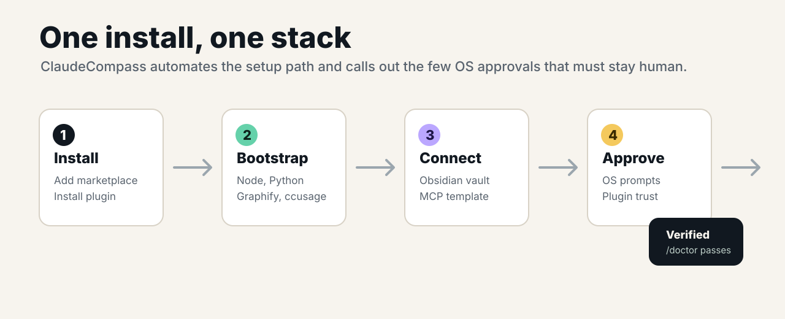

# ClaudeCompass



ClaudeCompass is a Claude Code connector/plugin starter that aims to make Claude easier for end users by installing and wiring the memory stack in one guided flow:

- Graphify for graph-first project memory and token reduction.
- Obsidian vault setup for durable human-readable notes.
- Token/cost visibility through `ccusage` statusline support.
- Claude Code user settings templates, permissions, hooks, and MCP templates.
- A doctor command that verifies what is installed and what still needs user approval.

This repo is intentionally honest about OS permissions: macOS and Windows may still require the user to approve privacy/security prompts. ClaudeCompass can open the path and configure the stack, but it should not bypass OS consent.



## What It Gives Users

ClaudeCompass is meant to feel like one connector that turns Claude Code from a raw terminal agent into a configured workspace companion:

- It remembers project context through Graphify and a human-readable Obsidian vault.
- It shows token and cost usage without asking users to remember commands.
- It prepares MCP config for Obsidian and Graphify.
- It adds conservative Claude Code permission defaults.
- It gives users `/setup`, `/doctor`, `/tokens`, `/memory`, and `/uninstall` entry points.

## Install from Local Checkout

```bash
claude plugin marketplace add ./ClaudeCompass
claude plugin install claude-compass@claude-compass
```

Then in Claude Code:

```text
/claude-compass:setup
/claude-compass:doctor
/claude-compass:tokens
```

## Bootstrap Directly

macOS:

```bash
./plugins/claude-compass/bin/bootstrap-macos.sh
```

Windows PowerShell:

```powershell
.\plugins\claude-compass\bin\bootstrap-windows.ps1
```

## Current Status

This is an early scaffold. The first implementation follows the Claude Code plugin structure documented by Anthropic: marketplace catalog at `.claude-plugin/marketplace.json`, plugin manifest at `plugins/claude-compass/.claude-plugin/plugin.json`, and plugin components at the plugin root.

The first implementation focuses on:

- safe setup scripts
- Claude plugin packaging
- settings merge with backup
- token monitor statusline
- MCP config template
- setup, doctor, memory, token, and uninstall skills
- graceful Graphify fallback when the package is unavailable

## Roadmap

- Add a polished desktop one-click installer.
- Add Obsidian Local REST API setup validation.
- Add project profile detection for Node, Python, Rust, Rails, Next.js, and Swift.
- Add automatic session summary hooks into the vault.
- Add Graphify query-before-search hooks.
- Add marketplace publishing workflow.
